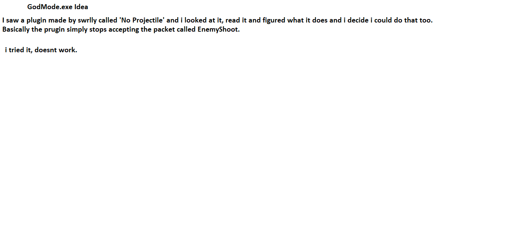
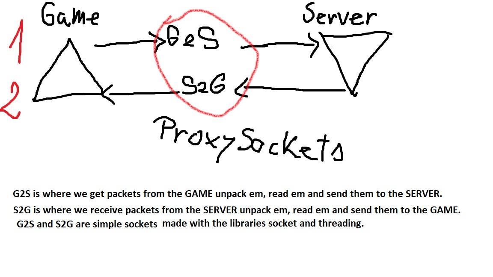
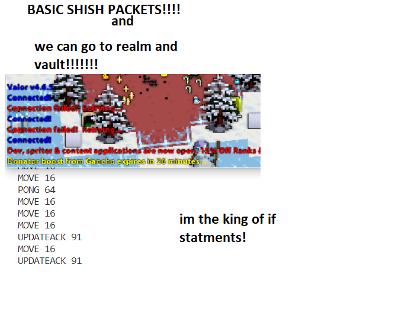
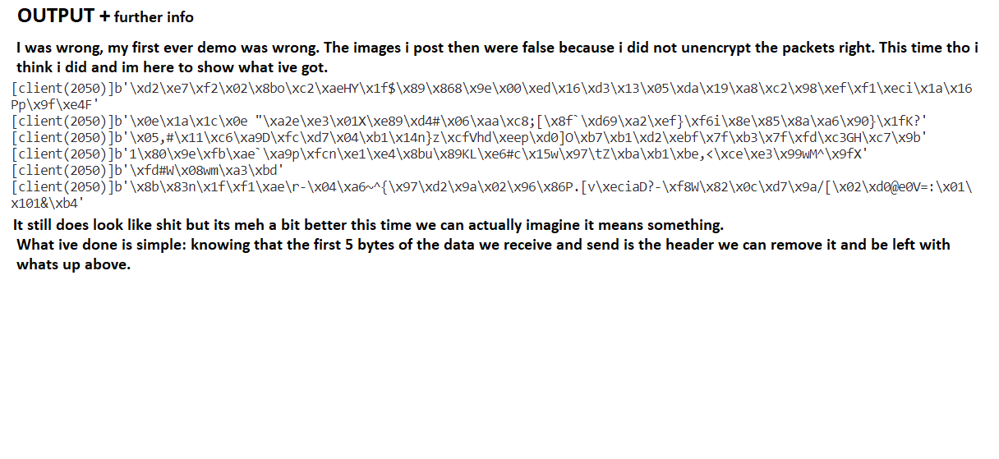
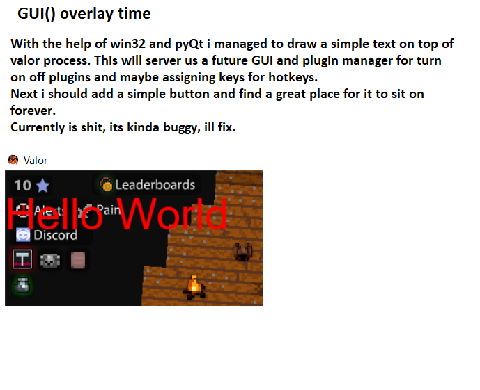

This is a wannabe MITM Proxy used to cheating on a game called Valor ROTMG.
Im trying to develop it from almost zero. God Bless!

# Current Stage/Problem = Packets/RC4 Cipher

  

### Main Idea

  

### A level deeper

  

### Basic IDs && Connect to realm or maybe vault (my way of doing the second part is childish asf, ill improve later)

  

### Demo
Here is the demo, improved, based on what ive done so far + fix for the first demo, decrypted part only

  

### Now is the best time to do something else, GUI

  

### TODO!!!
1. parse basic packets and ID them ---ALMOST DONE!
2. there are plugins made by Swrlly and i intend to ID the packets i need to use such plugins
3. HOOKING!!! FISHING! we need ID them packets to hook em and go brr brr ok? trust me bro
4. Create the overlay using process hooking and drawing on top of process --- DONE
 
## Resources 
* [UML-Class-Diagram](https://www.visual-paradigm.com/guide/uml-unified-modeling-language/uml-class-diagram-tutorial/).
* [Python-Socket-1](https://realpython.com/python-sockets/).
* [Python-Socket-2](https://docs.python.org/3/library/socket.html).
* [Readme.md-Syntax](https://docs.github.com/en/get-started/writing-on-github/getting-started-with-writing-and-formatting-on-github/basic-writing-and-formatting-syntax).
* [PyQt6](https://www.riverbankcomputing.com/static/Docs/PyQt6/api/qtwidgets/qwidget.html#qwidget).
* [PyWin32](http://timgolden.me.uk/pywin32-docs/contents.html).

## Thanking
* 