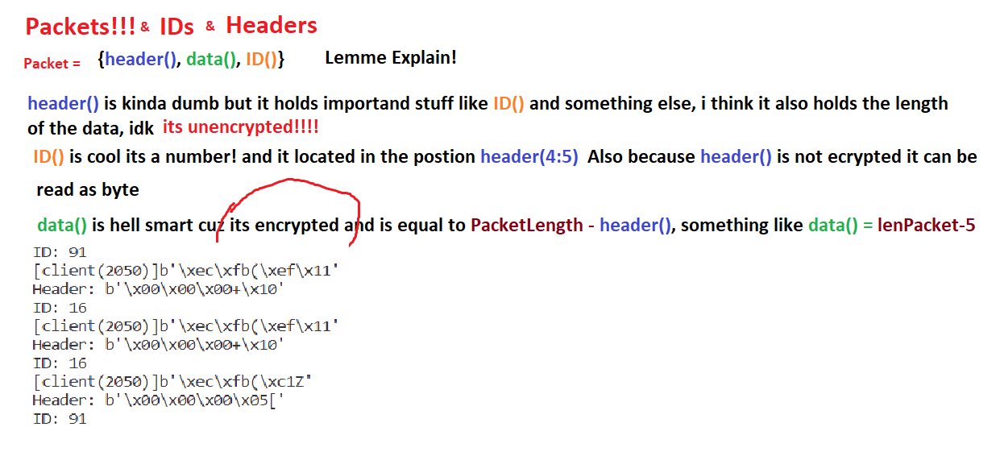

# try
 My dumb attempt at making a valor rotmg proxy. God Bless.

## Main Idea

  

## A level deeper

  

## Packets and IDs

  

## Basic IDs && Connect to realm or maybe vault (my way of doing the second part is childish asf, ill improve later)

  

## Demo
Here is the demo, improved, based on what ive done so far + fix for the first demo, decrypted part only

  

## Now is the best time to do something else, GUI

  

## Explaining
Ill keep it short and simple. The code is trash, Im trying and it wont work most likely but Ill try to document my adventure.

## TODO!!!
1. parse basic packets and ID them ---ALMOST DONE!
2. there are plugins made by Swrlly and i intend to ID the packets i need to use such plugins
3. HOOKING!!! FISHING! we need ID them packets to hook em and go brr brr ok? trust me bro
4. Create the overlay using process hooking and drawing on top of process --- DONE

## Down the line
For this project i wont be going the same route as Swrlly, i wont make a separated GUI instead i will attach to the valor.exe process and write on top of that making an overlay. 

### Resources 
https://realpython.com/python-sockets/
https://www.visual-paradigm.com/guide/uml-unified-modeling-language/uml-class-diagram-tutorial/
https://docs.python.org/3/library/socket.html
